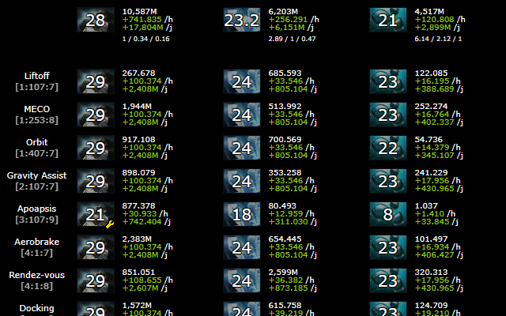
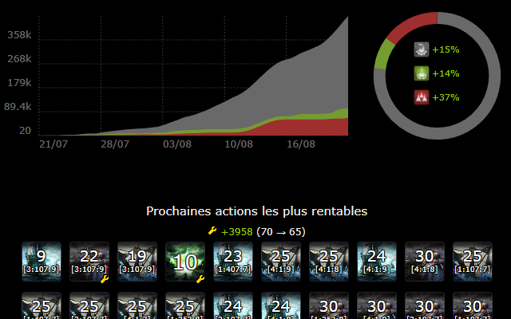
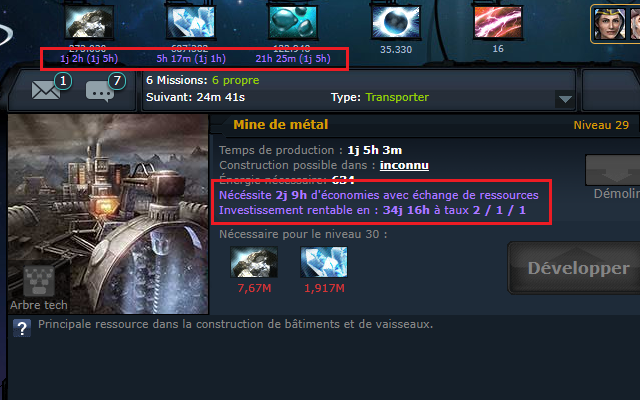
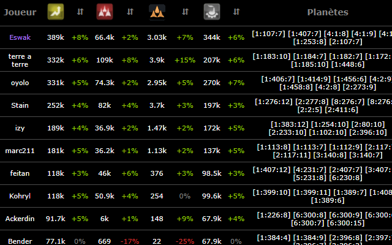
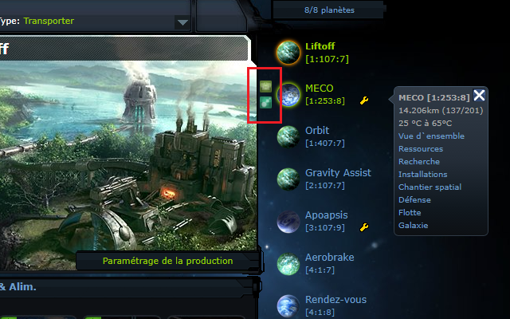
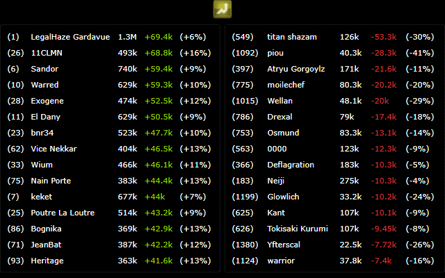
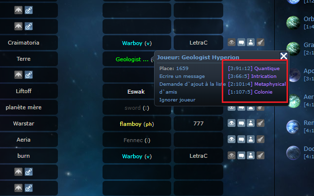

# [OGame UI++](https://addons.mozilla.org/en-US/firefox/addon/ogame-ui-extension/)
This is a fork of [Chrome Ogame UI++](https://github.com/eswak/chrome-ogame-ui-extension)

The firefox extension: [Firefox OGame UI++](https://addons.mozilla.org/en-US/firefox/addon/ogame-ui-extension/)

A Firefox extension that enhances the OGame interface by adding elements and menu entries.

## Compatibility Ogame Version:
  - 6.*
  - 7.*

## Languages
Available in-game languages :
 - :gb: English
 - :fr: French
 - :es: Spanish
 - :tr: Turkish
 - :de: German
 - :poland: Polish

## Features
This extension improves the user interface by adding several features :
  - Remaining storage time under current planet's resources
  - Statistices tab : look at all your planet's resources ticking in real time
  - Next recommended builds : know the ROI on your mines & build wisely
  - Pre-fill the solar satelite text field if you have negative energy
  - See the daily server top/flop (biggest point increase/drop)
  - Fast deploy/transport icons when you hover your planets
  - Add custom links in your left menu
  - Adding nearby player addon

## Errors
### QUOTA_EXCEEDED_ERR
  - Opera: opera:config -> Domain Quota For localStorage -> 15816
  - Firefox: about:config -> dom.storage.default_quota -> 15816

## Screenshots

